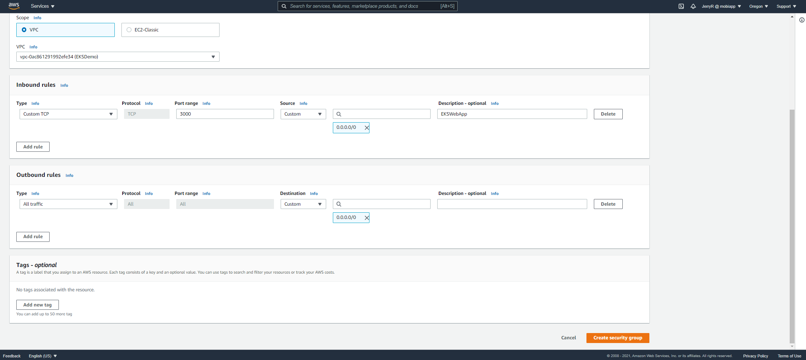

# Welcome to the EKS for AKS user's tutorial (GUI edition)

To get the most from this tutorial, you must know how to build an AKS cluster on Azure. In this tutorial you will build an EKS cluster on AWS, deploy worker nodes and install a simple guestbook application. 

## **Step 0: Before You Start**

You will need to make sure you have the following components installed and set up before you start with Amazon EKS:

- **AWS Account –** Sign up for a free AWS account [here.](https://aws.amazon.com/premiumsupport/knowledge-center/create-and-activate-aws-account/)
- **AWS CLI** – In this tutorial you will use the AWS CloudShell. 
- **kubectl** – A command line tool for working with Kubernetes clusters. This guide requires that you use version 1.18 or later. For more information, see [Installing kubectl](https://docs.aws.amazon.com/eks/latest/userguide/install-kubectl.html).
- **Required IAM permissions** – The IAM security principal that you're using must have permissions to work with Amazon EKS IAM roles and service linked roles, AWS CloudFormation (we have ARM templates), and a VPC (we have Vnets) and related resources. You must complete all steps in this guide as the same user.
- Guestbook-go application @ [examples/guestbook-go at master · kubernetes/examples (github.com)](https://github.com/kubernetes/examples/tree/master/guestbook-go)
  
## **Step 1: Creating the IAM Role**

Set up a new IAM role with EKS permissions.

  1.1 Open the [IAM console](https://console.aws.amazon.com/iam/), select **Roles** on the left and then click the **Create Role.**
    

  1.2 Choose **EKS** from the list of services, then **EKS - Cluster** for your use case, and then **Next: Permissions**.
    

  1.3 Choose **Next: Tags**. (Optional) Add metadata to the role by attaching tags as key–value pairs.

  1.4 Choose **Next: Review**.
    

  1.5 For **Role name**, enter a unique name for your role, such as eksClusterRole, then choose **Create role**.

  1.6 Next you will create a Node worker role.

  1.7 Choose **Roles**, then **Create role**.

  1.8 Choose **EC2** from the list of **Common use cases** under **Choose a use case,** then choose **Next: Permissions**.

  1.9 In the **Filter policies** box, enter AmazonEKSWorkerNodePolicy. Check the box to the left of **AmazonEKSWorkerNodePolicy**.

  1.10 In the **Filter policies** box, enter AmazonEC2ContainerRegistryReadOnly. Check the box to the left of **AmazonEC2ContainerRegistryReadOnly**.

  1.11 In the **Filter policies** box, enter AmazonEKS\_CNI\_Policy. Check the box to the left of **AmazonEKS\_CNI\_Policy**.

  1.12 Choose **Next: Tags**. (Optional) Add metadata to the role by attaching tags as key–value pairs.

  1.13 Choose **Next: Review**.
  
  1.14 For **Role name**, enter a unique name for your role, such as NodeInstanceRole. For **Role description**, replace the current text with descriptive text such as Amazon EKS - Node Group Role, then choose **Create role**.

## **Step 2: Creating the VPC for EKS**

Next, you are going to create a separate VPC for our EKS cluster. To do this, go to the [VPC Console](https://us-west-2.console.aws.amazon.com/vpc/home?region=us-west-2). 

  2.1 Open the [VPC Console](https://us-west-2.console.aws.amazon.com/vpc/), select **Launch VPC wizard** and select VPC with a Single Public Subnet.
    

  2.2 Choose **VPC with Single Subnet**. Name your VPC - EKSDemo, leave defaults for the CIDR and choose us-west-2a as your availability zone. Select **Create VPC**
    

  2.3 EKS requires two subnets in two different availability zones. In AWS subnets do not span Availability Zones. To add a add a subnet, navigate to **Subnets,** and select **Create Subnet** and place it in the opposite Availability Zone. To do this, click on subnet in the left pane.
    

  2.4 In the drop down, select the VPC you created in step 2 and select **Create Subnet.**
    

  2.5 Name your subnet Public Subnet 2 and place it in the opposite Availability Zone e.g., us-west-2b. Enter 10.0.1.0/24 as your IPv4 CIDR. Select **Create subnet**.
    

  2.6 Open the [VPC console](https://console.aws.amazon.com/vpc/),  and select **Subnets**.

  2.7 Select your subnet (Public Subnet) and choose **Subnet Actions**, **Modify auto-assign IP settings**. Repeat this step for Public Subnet 2
    

  2.8 The **Enable auto-assign public IPv4 address** check box, if selected, requests a public IPv4 address for all instances launched into the selected subnet. Select or clear the check box as required, and then choose **Save**.
  
  2.9 In the VPC Console, navigate to security groups, select Create security group. 
     

  2.10 In the Basic details, name your security group EKSDemoSG.

  2.11. Add a Description and select your VPC (EKSDemo)
    

  2.12 Under Inbound rules, select **Add rule**.
    

  2.13. Add the following values, Type = Custom TCP, Port range = 3000, Source = Custom 0.0.0.0/0, Description= EKSWebApp 
    

  2.14 Scroll down and select **Create security group**.

## **Step 3: Creating the EKS Cluster**

1.1 Open the [EKS console](https://us-west-2.console.aws.amazon.com/eks/), Name your EKS Cluster “EKSDemo” and click on the **Next step**.
    

2.2 You will see Cluster Name and Kubernettes version and cluster service role (IAM steps) are prefilled. Feel free to add a tag and/or select **Next**. 
    

2.3. Select the VPC you created in step 2. To keep it simple, leave it as public. Leave **Network add-on** settings as default and select **Next.**
    

2.4 Leave logging turned off and select **Next**.
    

2.5 Review and **Create.**
    

2.6 While cluster builds, take a 15-minute break. Refresh the screen when you come back. Refresh your browser. Notice the cluster is set to Active.
    

2.7 Open the [AWS Cloud Shell](https://us-west-2.console.aws.amazon.com/cloudshell/) andconnect to you cluster with the following command aws eks --region us-west-2 update-kubeconfig --name EKSDemo. Be sure to replace region and cluster name if you used different values listed in this tutorial. 
    

## **Step 4: Launching Kubernetes Worker Nodes**

The cluster alone won’t be enough. You need to have worker nodes so Kubernetes can schedule pods. Managed worker nodes will be created meaning that AWS takes care of the provisioning of the EC2 instance(s) in your account.
4.1 Add a Node Group by going to the **Compute** tab and selecting **Add Node Group.** Name your Node Group EKSDemoNode and select the NodeInstanceRole you created in Step 1. Leave the default settings and select **Next**.
     

4.2 On the Set Compute and Scaling, leave defaults and select **Next**. 
    

4.3 On the Specify networking leave as default –we will not need to SSH into the nodes for this tutorial. Uncheck the Allow Access to Remote Nodes. The screen will readjust. Select **Next**
    

4.4 In the Review and create view, review and make changes if necessary and select **Create.** The Node Group creation process will take ~15 minutes. When the process is complete, the status will show Active.
    

4.5 Open the [AWS Cloud Shell](https://us-west-2.console.aws.amazon.com/cloudshell/), set up Kubectl in the AWS CloudShell. AWS CloudShell doesn’t pursiust as Azure’s Cloud Shell does –so you may need to reconnect to your cluster.

Connect to your cluster e.g. aws eks --region us-west-2 update-kubeconfig --name EKSDemo
Download the latest release of Kubernettes

Curl -LO "https://storage.googleapis.com/kubernetes-release/release/$(curl -s https://storage.googleapis.com/kubernetes-release/release/stable.txt)/bin/linux/amd64/kubectl"

4.6.1 Maake **Kubectl** executable: chmod +x ./kubectl

4.6.2 Move the binary in to your PATH: sudo mv ./kubectl /usr/local/bin/kubectl

4.6.3 Test to ensure the version you installed is up-to-date: kubectl version –client

## **Step 5: Installing the Guestbook application**

Your AWS EKS cluster is created and set up. To take it for a spin, you are going to deploy a simple Guestbook app written in PHP and using Redis for storing guest entries.

The following commands create the different Kubernetes building blocks required to run the app — the Redis primary replication controller, the Redis primary service, the Redis secondary replication controller, the Redis slave service, the Guestbook replication controller and the guestbook service itself:

While in the in the AWS CloudShell, connect to your cluster aws eks --region us-west-2 update-kubeconfig --name EKSDemo
Run the following commands to install REDIS and the Guestbook:

5.1 kubectl apply -f https://raw.githubusercontent.com/kubernetes/examples/master/guestbook-go/redis-master-controller.json

5.2 kubectl apply -f https://raw.githubusercontent.com/kubernetes/examples/master/guestbook-go/redis-master-service.json

5.3 kubectl apply -f <https://raw.githubusercontent.com/kubernetes/examples/master/guestbook-go/redis-slave-controller.json>

5.4 kubectl apply -f <https://raw.githubusercontent.com/kubernetes/examples/master/guestbook-go/redis-slave-service.json>

5.5 kubectl apply -f <https://raw.githubusercontent.com/kubernetes/examples/master/guestbook-go/guestbook-controller.json>

5.6 kubectl apply -f https://raw.githubusercontent.com/kubernetes/examples/master/guestbook-go/guestbook-service.json

## **Step 6: View the guestbook**

You can now play with the guestbook that you just created by opening it in a browser (it might take a few moments for the guestbook to come up).

6.1 To view the guestbook, you will need the DNS name of your load balancer. Go to the [EC2 Console ](https://us-west-2.console.aws.amazon.com/ec2/v2) and navigate to Load Balancing -> Load Balancers to get the DNS name. 
    

6.2 Open a new tab on your web browser and paste the DNS name appending : 3000 to it, example **ac1f9e6d67dde4d9aa48eeaeb74dd0c3-2095639188.us-west-2.elb.amazonaws.com:3000** and press **ENTER**

6.3 .The guestbook displays in your browser, add your name and select **SUBMIT**.
    

## **Step 7: Clean up**

As you know the cloud is pay-as-you-go, so delete your resources.

7.1 While in the AWS Cloud Console, enter the following command kubectl delete -f examples/guestbook-go

7.2 Go the EKS Console and Navigate to compute, select your Node group example EKSDemoNode and select **Delete**.

7.3 After your Node Groups are deleted, go **Clusters** and select **Delete**. 

7.4  If you wish to cancel you AWS account, go [here](https://aws.amazon.com/premiumsupport/knowledge-center/close-aws-account/). 